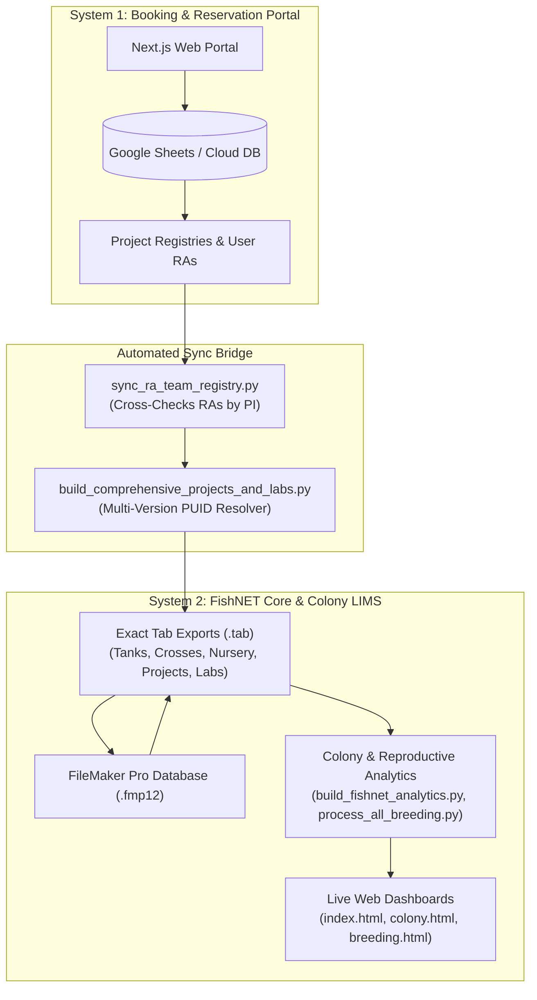

# FishNET Colony & Booking Integration — System Architecture & Maintenance Guide

## 1. System Architecture & Modularity Overview

The QU Zebrafish Facility operates on a modular two-tier architecture connected by a read-only synchronization bridge:



### Key Principles of Isolation
1. **System 1 (Booking Portal)** is strictly for researcher project registrations, equipment bookings, and access control.
2. **System 2 (FishNET Colony & LIMS)** manages physical rack/tank positions, pedigrees, reproductive pair synergies, and husbandry records.
3. **Bridge Sync** is strictly one-way read-only: pulling researcher and project registrations into FileMaker without risking live colony integrity.
4. **Staff Segregation Rule**: Facility Core Technologists (`AE`, `EA`, `SA`, `AF`, `FB`) are assigned exclusively to Core facility projects (`P001`, `P002`) and are never mixed into researcher project allocations.

---

## 2. Directory Structure & File Map

```
FishNET Data/Labels/
│
├── FishNet Exported Data/              # Official FileMaker Pro .tab Tables & Database
│   ├── Tanks.tab                       # 23-column headerless tank export (182 tanks)
│   ├── Crosses.tab                     # 24-column headerless crosses export (71 crosses)
│   ├── Nursery.tab                     # 18-column headerless nursery export (68 nursery rows)
│   ├── Projects.tab                    # 7-column multi-version project registry (46 versions)
│   ├── Labs.tab                        # 7-column lab portfolios mapped to PIs
│   ├── FishNET.tab                     # Legacy compatibility mirror
│   └── ZFL-BRC-*.fmp12                 # Master FileMaker Pro database
│
├── scripts/                            # Operational Production Pipeline
│   ├── sync_all_pipeline.py            # [MASTER] 1-Command end-to-end sync
│   ├── sync_ra_team_registry.py        # RA sorting & cross-checking engine
│   ├── build_comprehensive_projects_and_labs.py # Multi-version PUID & title builder
│   ├── build_fishnet_analytics.py      # Colony analytics, 4-mode pedigree & report generator
│   ├── process_all_breeding.py         # Reproductive data, pair synergies & grand compilation
│   ├── generate_integrated_dashboard.py# Interactive breeding & intelligence dashboard generator
│   ├── ingest_label_or_log.py          # Fast CLI & programmatic ingestion helper
│   ├── pi_team_registry.json           # PI -> Verified RA mapping cache
│   ├── project_titles.json             # Protocol -> Descriptive title lookup
│   ├── organized_projects_inventory.json # Folder & approval scan inventory
│   └── archive/                        # Safely archived scratch, diagnostic & migration scripts
│
├── archive/                            # Historical photos, raw log scans & legacy data
│   └── DONE/                           # Historical breeding logs (2024-2026)
│
├── index.html                          # Main Web Portal & Ingestion Hub
├── colony.html                         # Interactive Colony & 4-Mode Pedigree Dashboard
├── breeding.html                       # Integrated Reproductive Intelligence Dashboard
├── FishNET_Colony_Analytics_Report.xlsx# Excel report with multi-tab formatting
└── breeding_dashboard_data.json        # Compiled 2024-2026 reproductive dataset (2,233 events)
```

---

## 3. Daily & Routine Operations

### Master Synchronization (1-Command Execution)
Whenever new data is added, exported from FileMaker, or modified:
```powershell
python scripts/sync_all_pipeline.py
```
This automatically:
1. Cross-checks user RA registrations against project orders and groups them by PI.
2. Re-generates `Projects.tab` and `Labs.tab` with persistent PUIDs and descriptive titles.
3. Re-computes colony health, rack occupancy, sex ratios, and 4-mode pedigrees (`FishNET_Interactive_Dashboard.html`).
4. Re-calculates 2024–2026 reproductive outcomes and 135 cross-pair synergies (`breeding_dashboard_data.json`).
5. Updates web distribution files (`index.html`, `colony.html`, `breeding.html`).

---

## 4. FileMaker Import / Export Schema Standards

All `.tab` files exported from and imported into FileMaker Pro are **tab-delimited and headerless** (row 1 is record 1).

### A. Tanks (`Tanks.tab` / `FishNET.tab` — 23 Columns)
| Index | Field Name | Type / Example | Description |
|---|---|---|---|
| 0 | Date of Birth | `10-08-2026` | Date of birth (DD-MM-YYYY) |
| 1 | Date of Death | `15-09-2026` | Euthanasia date (blank if active) |
| 2 | Derivative Cross | `C0072` | Parent Cross CUID |
| 3 | Facility | `BRC` | Facility room/building |
| 4 | Females | `0` | Female fish count |
| 5 | Genotype | `AB wildtype` | Line / genotype name |
| 6 | Lab Member | `AE` | Assigned handler / technician |
| 7 | Males | `0` | Male fish count |
| 8 | Notes | `Graduated from C0072` | Comments / background notes |
| 9 | Number of Fish | `30` | Total live fish in tank |
| 10 | Protocol | `P001` | Associated Project PUID |
| 11 | Rack Number | `1` | Rack identifier |
| 12 | Room | `126` | Room number |
| 13 | Row Letter | `A` | Shelf / row letter |
| 14 | Search | `AB wildtype` | Search index field |
| 15 | Space Number | `1` | Column / position number |
| 16 | Status | `Adult/Active` | Adult/Active vs Euthanized |
| 17 | Subspace Number | `1` | Subspace slot |
| 18 | Tank Size | `3L` | Tank capacity (1.5L, 3L, 10L) |
| 19 | tankCount | `1` | Unit count |
| 20 | TUID | `T0182` | Unique Tank Identifier (`T0001`–`T9999`) |
| 21 | Turnover Date | `10-10-2026` | Scheduled tank cleaning date |
| 22 | Laboratories::Lab Name | `Core Facility` | Owning laboratory |

### B. Crosses (`Crosses.tab` — 24 Columns)
`[# dead 0h, # dead 24h, # surv 0h, # surv 24h, 0h SR%, 24h SR%, Admin, CUID, Date Ended, Date of Birth, Date Started, Maternal ID, Mating Outcome, Notes, Number of Tanks, Paternal ID, Protocol, Set up by, Status, Lab Members Cross::Lab Name, Tanks_Maternal::Genotype, Tanks_Maternal::Notes, Tanks_Paternal::Genotype, Tanks_Paternal::Notes]`

### C. Nursery (`Nursery.tab` — 18 Columns)
`[NUID, Number of Fish, Status, Fish Crosses::Admin, Fish Crosses::CUID, Fish Crosses::Date Ended, Fish Crosses::Date for transfer, Fish Crosses::Date of Birth, Fish Crosses::Date Started, Fish Crosses::Maternal ID, Fish Crosses::Paternal ID, Fish Crosses::Protocol, Fish Crosses::Set up by, Lab Members Cross::Lab Name, Tanks_Maternal::Genotype, Tanks_Maternal::Notes, Tanks_Paternal::Genotype, Tanks_Paternal::Notes]`

### D. Projects (`Projects.tab` — 7 Columns)
`[PUID, Protocol Number, Project Title, Principal Investigator, Start Date, End Date, Status]`

---

## 5. Adding New Physical Labels & Breeding Logs

### Option 1: Fast Web UI Modal (Recommended for Daily Use)
1. Open [index.html](file:///c:/Users/ae20164/OneDrive%20-%20Qatar%20University%20%281%29/Zebrafish%20shared%20folder/FishNET%20Data/Labels/index.html) in your browser.
2. Click **"Ingest New Label / Logsheet"** at the top right.
3. Select **Label Photo Graduation** or **Breeding Logsheet**.
4. Upload the image / fill in the graduation fields and click **Confirm & Synchronize**.

### Option 2: CLI Ingestion
```powershell
python scripts/ingest_label_or_log.py --type label --line "AB wildtype" --origin "C0072 (AB T128)" --dob "10-08-2026" --count 12 --size "1.5L" --protocol "P001"
```

---

## 6. RA Registration & Cross-Checking

When new Research Assistants register via the booking portal:
1. `scripts/sync_ra_team_registry.py` reads user profiles and cross-checks them against active PI project reservations.
2. If the user's selected PI matches the project PI, they are placed under that PI's team in `pi_team_registry.json`.
3. Running `sync_all_pipeline.py` propagates the updated team rosters directly into `Labs.tab` and the web dashboards.
